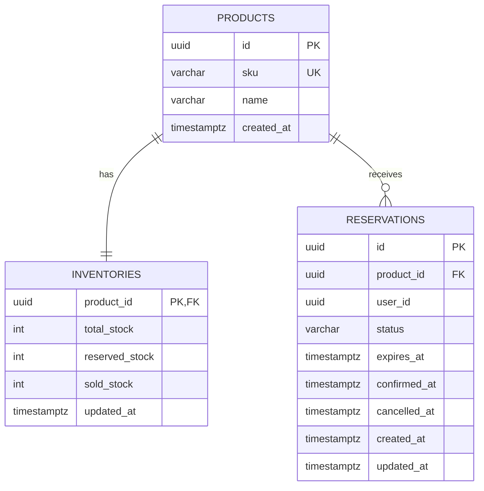

# Data Model — Inventory Reservation System

## 1. Entity Overview



## 2. PostgreSQL DDL

```sql
CREATE TABLE products (
    id UUID PRIMARY KEY,
    sku VARCHAR(100) NOT NULL UNIQUE,
    name VARCHAR(255) NOT NULL,
    created_at TIMESTAMPTZ NOT NULL DEFAULT NOW()
);

CREATE TABLE inventories (
    product_id UUID PRIMARY KEY REFERENCES products(id) ON DELETE CASCADE,
    total_stock INTEGER NOT NULL CHECK (total_stock >= 0),
    reserved_stock INTEGER NOT NULL DEFAULT 0 CHECK (reserved_stock >= 0),
    sold_stock INTEGER NOT NULL DEFAULT 0 CHECK (sold_stock >= 0),
    updated_at TIMESTAMPTZ NOT NULL DEFAULT NOW(),
    CONSTRAINT inventory_capacity_check
        CHECK (reserved_stock + sold_stock <= total_stock)
);

CREATE TABLE reservations (
    id UUID PRIMARY KEY,
    product_id UUID NOT NULL REFERENCES products(id) ON DELETE RESTRICT,
    user_id UUID NOT NULL,
    status VARCHAR(20) NOT NULL
        CHECK (status IN ('ACTIVE', 'CONFIRMED', 'CANCELLED', 'EXPIRED')),
    expires_at TIMESTAMPTZ NOT NULL,
    confirmed_at TIMESTAMPTZ NULL,
    cancelled_at TIMESTAMPTZ NULL,
    created_at TIMESTAMPTZ NOT NULL DEFAULT NOW(),
    updated_at TIMESTAMPTZ NOT NULL DEFAULT NOW()
);

CREATE INDEX reservations_product_status_idx
    ON reservations(product_id, status);

CREATE INDEX reservations_expiry_idx
    ON reservations(product_id, status, expires_at)
    WHERE status = 'ACTIVE';
```

## 3. Derived Value

Available stock is not stored separately:

```sql
SELECT
    total_stock,
    sold_stock,
    reserved_stock,
    total_stock - sold_stock - reserved_stock AS available_stock
FROM inventories
WHERE product_id = $1;
```

This directly preserves the source challenge formula:

```text
Available Stock = Total Stock - Confirmed Sales - Active Reservations
```

## 4. State/Counter Mapping

| Reservation state | Holds reserved stock? | Counts as sold? |
|---|---:|---:|
| `ACTIVE` | Yes | No |
| `CONFIRMED` | No | Yes |
| `CANCELLED` | No | No |
| `EXPIRED` | No | No |

## 5. Transaction Patterns

### Reserve

```text
BEGIN
  lock inventory row FOR UPDATE
  expire stale ACTIVE reservations for product
  decrement reserved_stock by number expired
  calculate available stock
  if available <= 0 -> ROLLBACK / conflict
  insert ACTIVE reservation with expires_at = now + 2 minutes
  increment reserved_stock
COMMIT
```

### Confirm

```text
BEGIN
  determine immutable product_id for reservation
  lock inventory row FOR UPDATE
  lock reservation row FOR UPDATE
  if ACTIVE but expired:
      mark EXPIRED
      decrement reserved_stock
      COMMIT
      return conflict
  if status != ACTIVE -> conflict
  mark CONFIRMED
  decrement reserved_stock
  increment sold_stock
COMMIT
```

### Cancel

```text
BEGIN
  determine immutable product_id for reservation
  lock inventory row FOR UPDATE
  lock reservation row FOR UPDATE
  if status != ACTIVE -> conflict
  if already expired:
      mark EXPIRED
  else:
      mark CANCELLED
  decrement reserved_stock
COMMIT
```

## 6. Why Counters Are Stored

The source formula could be calculated by counting reservation rows on every request, but stored counters keep the critical availability check O(1). Correctness is preserved by changing reservation state and counters inside the same transaction, with a database CHECK constraint as a second safety layer.
