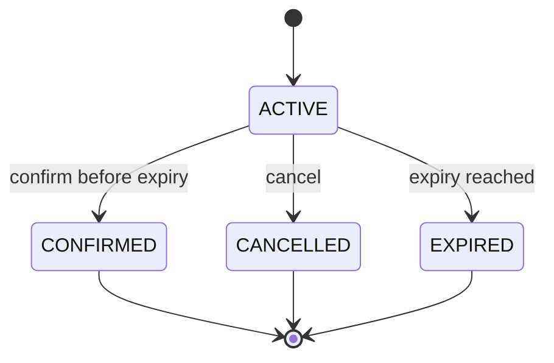

# Spec 001 — Inventory Reservation System

**Status:** Draft for implementation  
**Primary scope:** Backend coding challenge  
**Preferred stack:** TypeScript, Node.js, React, relational persistence  
**Proposed database:** PostgreSQL

---

## 1. Problem Statement

Flash-sale systems can receive hundreds of simultaneous purchase attempts against very limited stock. Without concurrency control, multiple users may reserve the same final item, producing overselling.

The system must provide temporary inventory reservations, allow a reservation to be confirmed or cancelled, automatically release expired reservations, and keep inventory consistent under concurrent requests.

### Source-derived scenario

- Limited-stock products may receive hundreds of simultaneous requests.
- Example: stock = `1`, simultaneous requests = `500`.
- Without concurrency control, multiple users may reserve the same item.
- Expected concurrent result: exactly `1` successful reservation and `499` failures.

---

## 2. Goals

### G-001 — Prevent overselling
Available stock must never become negative and confirmed sales plus active reservations must never exceed total stock.

### G-002 — Handle concurrent requests safely
Concurrent reservation requests for the same product must be serialized at the inventory decision point so only valid reservations are created.

### G-003 — Support temporary reservations
A successful reservation holds one inventory unit for two minutes.

### G-004 — Support reservation lifecycle
Reservations use the source-defined states:

- `ACTIVE`
- `CONFIRMED`
- `CANCELLED`
- `EXPIRED`

### G-005 — Maintain consistent state
Reservation state changes and inventory counters must commit atomically.

### G-006 — Provide reproducible environments
The core backend must use Docker as its supported infrastructure setup for development, database-backed testing, and production deployment builds so that the same application and PostgreSQL dependencies can be reproduced from a clean checkout.

---

## 3. Non-Goals

The original challenge does not require the following, so they are out of scope for the core implementation:

- Authentication or authorization
- Payment gateway integration
- Shopping cart behavior
- Multi-warehouse inventory
- Distributed event streaming
- Inventory replenishment workflows
- Reversing confirmed purchases
- Multi-item reservation quantities

A React UI may be implemented as a small demo client, but it is not part of the source challenge's backend evaluation requirements.

---

## 4. Business Rules

### BR-001 — Available stock formula

```text
Available Stock = Total Stock - Confirmed Sales - Active Reservations
```

For the proposed relational implementation:

```text
available_stock = total_stock - sold_stock - reserved_stock
```

Where:

- `sold_stock` represents confirmed purchases.
- `reserved_stock` represents currently active reservations.

### BR-002 — Reservation capacity
A reservation must fail when available stock is `0`.

### BR-003 — Last item exclusivity
Only one user may reserve the last available item.

### BR-004 — Reservation hold duration
An active reservation holds one inventory unit for exactly two minutes from creation.

### BR-005 — Confirmation
Confirming an active, non-expired reservation completes the purchase.

### BR-006 — Confirmed purchase finality
A confirmed purchase cannot be reversed by this system.

### BR-007 — Cancellation
Cancelling an active reservation releases its reserved inventory.

### BR-008 — Expiry
An active reservation whose expiry time has passed becomes expired and releases its reserved inventory.

### BR-009 — Atomicity
A reservation lifecycle transition and its corresponding inventory counter update must occur in the same database transaction.

---

## 5. Reservation State Machine



Terminal states:

- `CONFIRMED`
- `CANCELLED`
- `EXPIRED`

No transition out of a terminal state is allowed.

---

## 6. Functional Requirements

### FR-001 — Read inventory state
The system shall expose current inventory values for a product:

- total stock
- sold stock
- reserved stock
- available stock

### FR-002 — Create reservation
Given a valid product with available stock greater than zero, the system shall:

1. atomically verify availability,
2. create an `ACTIVE` reservation,
3. set `expires_at = created_at + 2 minutes`,
4. increment reserved stock by one,
5. return the reservation identifier and expiry time.

### FR-003 — Reject unavailable reservation
If available stock is zero at the transaction's inventory decision point, the reservation request shall fail and no reservation shall be created.

### FR-004 — Confirm reservation
Given an `ACTIVE`, non-expired reservation, confirmation shall:

1. set status to `CONFIRMED`,
2. decrement reserved stock by one,
3. increment sold stock by one,
4. persist the transition atomically.

### FR-005 — Cancel reservation
Given an `ACTIVE`, non-expired reservation, cancellation shall:

1. set status to `CANCELLED`,
2. decrement reserved stock by one,
3. persist the transition atomically.

### FR-006 — Expire reservation
When an `ACTIVE` reservation reaches its expiry time, the system shall:

1. set status to `EXPIRED`,
2. decrement reserved stock by one,
3. make the released stock available to future reservations.

### FR-007 — Lazy expiry before reservation checks
Before making a new availability decision for a product, the system shall release any expired `ACTIVE` reservations for that product within the same inventory lock/transaction.

This is a proposed implementation rule to ensure correctness even if a background expiry worker is delayed or the application restarts.

### FR-008 — Periodic expiry cleanup
The backend should run a lightweight periodic cleanup process that expires stale active reservations. This is proposed for timely housekeeping; correctness must not depend solely on this worker because FR-007 provides lazy expiry.

### FR-009 — Concurrency safety
For requests targeting the same product inventory, all stock-mutating transactions shall coordinate on a single database-level inventory lock.

### FR-010 — Terminal-state protection
Attempts to confirm or cancel a reservation already in a terminal state shall fail without changing inventory.

---

## 7. Proposed HTTP API Semantics

These transport details are proposed; the source challenge defines behavior, not HTTP contracts.

| Operation | Method | Path | Success | Main failure |
|---|---|---|---|---|
| Get inventory | `GET` | `/api/v1/products/{productId}/inventory` | `200` | `404` |
| Reserve item | `POST` | `/api/v1/products/{productId}/reservations` | `201` | `409` no stock |
| Get reservation | `GET` | `/api/v1/reservations/{reservationId}` | `200` | `404` |
| Confirm | `POST` | `/api/v1/reservations/{reservationId}/confirm` | `200` | `409` invalid/expired state |
| Cancel | `POST` | `/api/v1/reservations/{reservationId}/cancel` | `200` | `409` invalid state |

### Reserve request

```json
{
  "userId": "4c6210de-507f-44f4-a29e-88275899ab70"
}
```

### Reserve success

```json
{
  "id": "0c0a8f51-9ee8-4d4c-a950-4f69c0f6d041",
  "productId": "90ea4659-161c-46ae-9370-4a26db65f21c",
  "userId": "4c6210de-507f-44f4-a29e-88275899ab70",
  "status": "ACTIVE",
  "expiresAt": "2026-08-12T00:02:00.000Z"
}
```

### Out-of-stock error

```json
{
  "code": "OUT_OF_STOCK",
  "message": "No inventory is currently available for reservation."
}
```

---

## 8. Relational Invariants

The following invariants must always hold after a committed transaction:

```text
0 <= sold_stock
0 <= reserved_stock
0 <= total_stock
sold_stock + reserved_stock <= total_stock
available_stock = total_stock - sold_stock - reserved_stock
```

Reservation-to-counter consistency:

```text
reserved_stock = number of ACTIVE reservations currently holding stock
sold_stock     = number of CONFIRMED reservations
```

For the challenge scope, each reservation represents exactly one inventory unit.

---

## 9. Concurrency Specification

### Locking strategy

Use a PostgreSQL row-level lock on the inventory record:

```sql
SELECT *
FROM inventories
WHERE product_id = $1
FOR UPDATE;
```

All stock-mutating flows for a product must acquire this lock before changing inventory counters.

### Why database locking

An in-process JavaScript mutex protects only one Node.js process. A relational row lock remains correct if the API later runs with multiple Node.js workers or multiple application instances using the same database.

### Lock scope

The inventory lock must cover:

1. stale reservation expiry for the product,
2. availability calculation,
3. reservation creation or state transition,
4. inventory counter update,
5. transaction commit.

### Lock ordering

Where both inventory and reservation rows are locked, the implementation should lock the inventory row first and then the reservation row. This is a proposed deadlock-avoidance convention.

---

## 10. Containerization Requirements

These are repository delivery requirements added for this project. They do not change the source-derived reservation business behavior.

### CR-001 — Containerized from initial setup

Containerization must be implemented during project setup, before feature phases depend on manually installed infrastructure. The repository must include:

- a version-controlled Dockerfile with separate development/test and production build concerns,
- version-controlled Docker Compose configuration for local orchestration,
- a `.dockerignore`, and
- documented environment-variable templates that contain no secrets.

### CR-002 — Development environment

From a clean checkout, a documented Docker Compose command must build and start the core API and PostgreSQL dependencies without requiring a host-installed Node.js or PostgreSQL runtime. The development setup must provide:

- source-mounted or otherwise rebuildable application code,
- a persistent development database volume,
- service health checks and readiness-aware startup, and
- an explicit, documented migration command or migration service.

Host-native tooling may remain available as an optional convenience, but it is not the only supported development path.

### CR-003 — Test environment

Unit, integration, and concurrency suites must be runnable through documented Docker commands. Database-backed tests must use a real, isolated PostgreSQL test database and must not share data or persistent volumes with development or production environments.

The containerized test workflow must propagate the test process exit code and clean up disposable test infrastructure after execution. It must not serialize or weaken the 500-request concurrency acceptance test.

### CR-004 — Deployment image

The core API must produce a production-ready container image from the same version-controlled Dockerfile. The production image must:

- use a multi-stage build or equivalent separation so build tooling and development dependencies are excluded from the runtime image,
- run as a non-root user,
- use environment-based configuration without embedding secrets,
- expose a health check suitable for deployment orchestration,
- start the API independently of schema migration execution, and
- handle process termination signals gracefully.

Database migrations must be runnable as an explicit release/deployment step using the same application image or a dedicated migration target. Application startup must not allow multiple replicas to race an implicit migration.

### CR-005 — Reproducible dependencies

Node.js and PostgreSQL container images must use intentional, reviewable version tags rather than floating `latest` tags. Dependency installation inside image builds must use the repository lockfile.

If the optional React demo becomes deployable scope, it must also have a documented production container build or be included deliberately in another production image.

---

## 11. Acceptance Criteria

### AC-001 — Basic reservation success
**Given** a product with total stock `1`, sold stock `0`, and reserved stock `0`  
**When** User A reserves the item  
**Then** the request succeeds  
**And** reserved stock becomes `1`  
**And** available stock becomes `0`.

### AC-002 — Reservation rejection when unavailable
**Given** available stock is `0`  
**When** User B attempts to reserve  
**Then** the request fails  
**And** no reservation row is created  
**And** inventory counters do not change.

### AC-003 — Confirm reservation
**Given** an active reservation that has not expired  
**When** it is confirmed  
**Then** its state becomes `CONFIRMED`  
**And** reserved stock decreases by `1`  
**And** sold stock increases by `1`  
**And** available stock does not increase.

### AC-004 — Cancel reservation
**Given** an active reservation  
**When** it is cancelled  
**Then** its state becomes `CANCELLED`  
**And** reserved stock decreases by `1`  
**And** available stock increases by `1`.

### AC-005 — Reservation expiry
**Given** an active reservation older than the two-minute hold period  
**When** expiry processing occurs or a new reservation triggers lazy expiry  
**Then** the stale reservation becomes `EXPIRED`  
**And** reserved stock decreases by `1`  
**And** the inventory becomes reservable again.

### AC-006 — Confirmed purchase cannot be reversed
**Given** a confirmed reservation  
**When** a cancel or expiry transition is attempted  
**Then** the transition fails  
**And** sold stock remains unchanged.

### AC-007 — Concurrency test
**Given** total stock is `1`  
**And** `500` reservation requests are executed simultaneously  
**When** all requests finish  
**Then** exactly `1` request succeeds  
**And** exactly `499` requests fail  
**And** reserved stock is `1`  
**And** sold stock is `0`  
**And** available stock is `0`.

### AC-008 — No overselling invariant
After any test or API sequence:

```text
sold_stock + reserved_stock <= total_stock
```

must be true.

### AC-009 — Reproducible container workflows

**Given** a clean checkout with Docker and Docker Compose available
**When** the documented development command is run
**Then** the API and a healthy PostgreSQL dependency start successfully
**And** migrations can be applied through the documented container workflow.

**When** the documented containerized test command is run
**Then** unit, integration, and 500-request concurrency tests execute against isolated test infrastructure
**And** the command returns a non-zero status if any test fails.

**When** the production image is built and started with valid runtime configuration
**Then** it starts as a non-root process
**And** its health check reports readiness without requiring development dependencies in the runtime image.

---

## 12. Evaluation Mapping

The source evaluation criteria map to this spec as follows:

| Source criterion | Spec coverage |
|---|---|
| Correctness | BR-001–BR-009, AC-001–AC-008 |
| Concurrency handling | FR-009, Section 9, AC-007 |
| Expiry logic | FR-006–FR-008, AC-005 |
| Code quality | plan.md architecture and task boundaries |
| Clear locking strategy explanation | Section 9 |
| Reproducible delivery environments | G-006, CR-001–CR-005, AC-009 |

---

## 13. React Demo Scope — Optional

Because the preferred stack includes React, an optional demo client may provide:

- inventory summary,
- reserve action,
- active reservation countdown,
- confirm action,
- cancel action,
- reservation state display.

The concurrency acceptance test should remain an automated backend/integration test rather than a browser-driven test.

---

## 14. Assumptions Added for Executability

The following are repository-defined decisions because the source challenge does not specify them:

- PostgreSQL is the relational database.
- Each reservation is for exactly one item.
- HTTP status codes and payloads follow Section 7.
- `userId` is an opaque UUID; authentication is out of scope.
- Confirming or cancelling an expired/terminal reservation returns a conflict response.
- Lazy expiry is used to guarantee correctness independent of the expiry worker.
- Docker is the supported infrastructure path for development, database-backed testing, and production deployment builds.

Source-derived assumptions should be changed if the evaluator provides different constraints. Containerization remains an explicit repository delivery requirement unless that requirement is intentionally revised.
